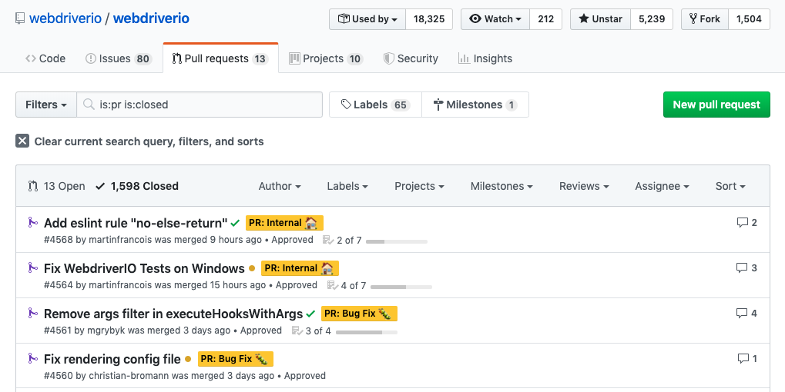

# 怎麼挑選外部模組 (2/3)

有時候從外顯資訊來判斷模組的好壞，不一定會很準確，例如星星數的多寡，可能是模組本身可能因某些特殊事件，而忽然湧進灌進大量的星星數。

例如：

- GitHub 上的「中國之亂」：亂刷星星數、issue 當成聊天室，搞到全球工程師都快瘋掉啦！: <https://buzzorange.com/techorange/2018/09/25/github-china-ruin-it/>
- 號稱全球最大的男性社交網站 GitHub 是怎樣的存在？:<https://kknews.cc/zh-tw/code/axjerqx.html>

所以有時候反而旁敲側擊，還比較可靠，那我們可以從哪些內隱資訊來判斷呢？我們用 `webdriverio` 這個 Open Source 專案來舉例。

## 怎麼從 pull request 來判斷

**解讀 Open PR 列表裡的資訊**

<https://github.com/webdriverio/webdriverio/pulls>

- 13 個 Open 狀態的 PR
- 1,598 個 Closed 狀態的 PR
- 昨天的 PR 有 41 個討論文

從 Open 跟 Closed 的數量的比例來看，看起來是有人「定期」在 review PR，所以不會累積太多。從討論文數量來看，似乎使用者也蠻積極的在參與。

**解讀 Closed PR 列表裡的資訊**

<https://github.com/webdriverio/webdriverio/issues>

- 九個小時之前，有一個 PR 被 merged，代表哪天你要發一個 PR 給維護者，這個 PR review 很快就可以被處理。

## 怎麼看 issue 來判斷

- 查看列表上有標示為 `Bug` 的 issue，那些只知的 Bug 是否在你的忍受範圍。

## 作者的動機跟野心

<https://github.com/webdriverio/webdriverio/graphs/contributors>

通常從 `Insights > Contributors` 的頁面位置，就可以看到主要維護者是哪幾位，以目前這個例子來說，主要作者就是 `Christian Bromann`，捐獻超過 500 行程式碼的開發者，也有 10 人以上。

<https://github.com/christian-bromann>

那我們再來看看作者的個人頁面，他目前在 `Sauce Lab` 公司工作，這個框架是因為他本身工作上的需要而創立的，所以他有強烈維護此框架的需求。從儀表板的綠色分佈而言，也看得出他是一個非常自律的人。

> Sauce Lab 是一間頗有名氣的雲端測試平台的供應商

## 背後是某有資源支持

蠻多框架的前身，都是某公司公司自己內部就有使用的工具，例如 `jest` 來自 facebook、 `protractor` 來自 `AngularJS` 團隊，`AngularJS` 來自微軟。

在這裡我強調的是「資源」，因為即使是大公司出產的模組，但是維護那個模組的團隊，要不到資源也是枉然，像有許多 Google 出產的框架，都是一個或少數個工程師維護多個模組的情況。
